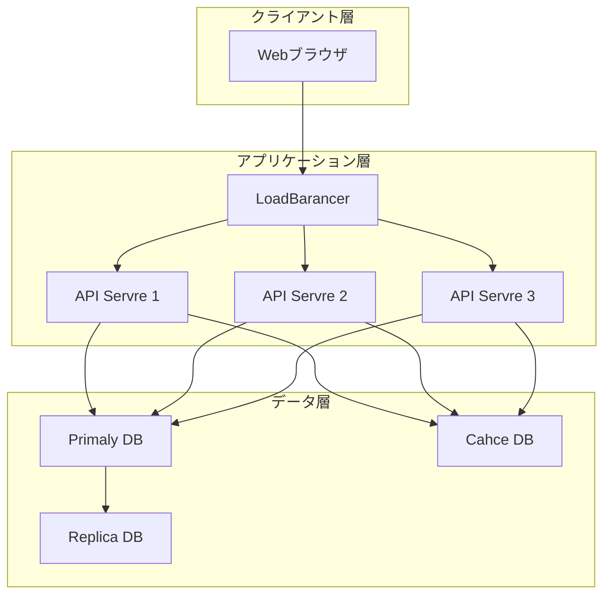
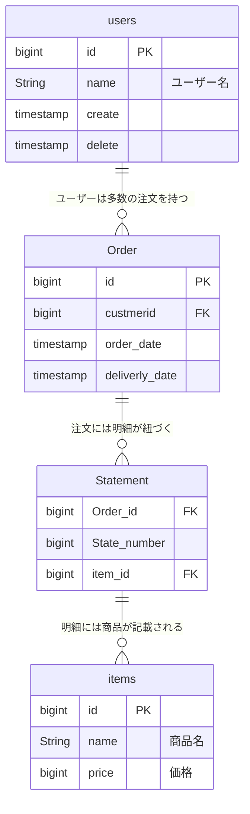
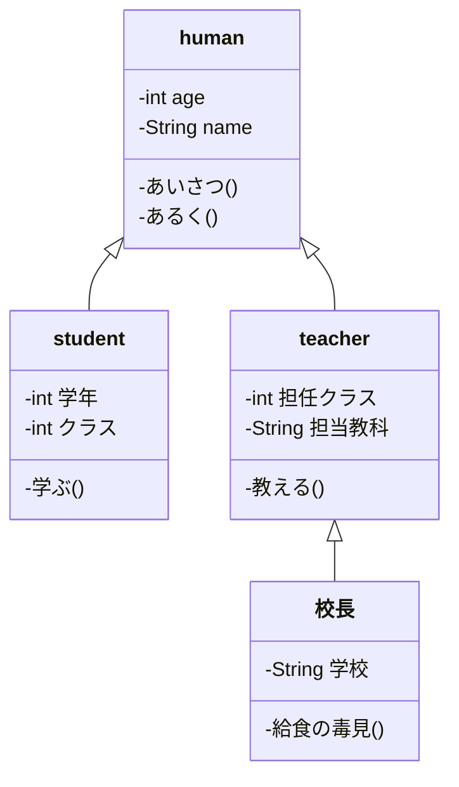
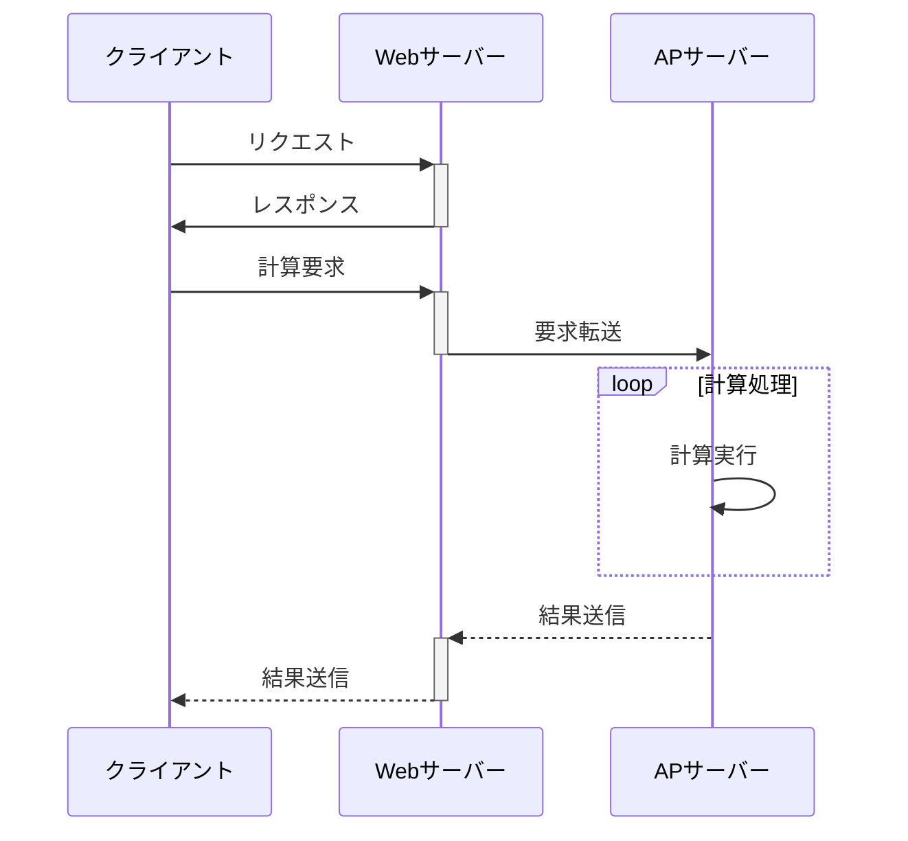
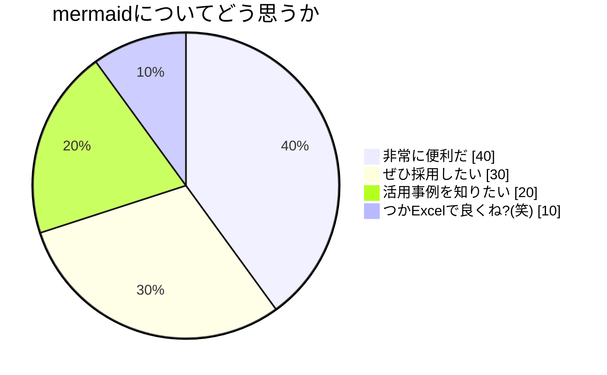

# 設計書サンプル

 ※このファイルは設計書のサンプルとしてmermaidを紹介するために作成されたものです。このファイル内で作成した図・仕様などは実在するシステムとは一切関係ありません

* アーキテクチャ図
システムアーキテクチャを説明するための図です。
基本的な3層アーキテクチャを採用した場合の図をサンプルとして掲示します。
  

* ER図
DBの論理設計に用いる図です。
スキーマごとの属性と、属性間のリレーションを説明します。

* クラス図
オブジェクト指向プログラミングを行う際に各クラスの定義とそのポリモーフィズムを定義できます。(詳細設計での使用を想定)

*シーケンス図
処理の流れを整理するシーケンス図です。

* 円グラフ
UMLの他、円グラフを書きこともできます。

