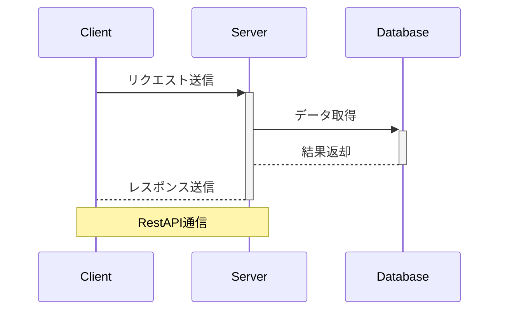

# 初めに

このファイルはMarkdownの練習兼魅力を知っていくための説明ファイルです。
Markdownで文書を作ろう！！

## 目次

1. Markdownとは
1. 使用するメリット
1. 図表の書き方

## 1.Markdownとは

Markdownはマークアップ言語[^1]の1種で、軽量かつ簡潔に文書を作成することができます。

## 2.使用するメリット

マークアップ言語の1つと聞いて、「HTMLでも良いのでは？」と思う方もいるかもしれません。
ですが、ざっとあげるだけでこれだけのメリットがあるんです！

* ファイルが軽量
* HTMLに比べて記述が早い
* 文字の強調や図の挿入ができる
* 拡張ツール[^2]を導入すれば図が書ける
* AIにとっても理解がしやすい

順番にメリットを見ていきましょう。

* ### ファイルが軽量

Markdownのメリットの1つにファイルが軽量なことが挙げられます。
markdownの実態はテキストファイルなので、文字データしか扱っていません。
また、HTMLより記述量が少ないため、必然的に軽量ファイルとなるわけです。

* ### HTMLに比べて記述が早い

1つ目のメリットでも述べましたが、MarkdownはHTMLより記述が少なく済みます。
例えば、見出しを書く時のときの違いを見てみましょう。
　　
**HTMLの場合**

```HTML:HTMLの場合
<h1>これは見出しです</h1>
```
　　
**Markdownの場合**

```Markdown:Markdownの場合
# これは見出しです
```

いかがでしょうか？
HTMLの場合はタグで挟む必要があったのに対し、Markdownの場合は#記号のみで完結します。[^3]

このように、Markdownは慣れると記述がかなり早くなります。
それに付随しますが、Markdownは**素の状態でも読みやすくする**という思想をもとに作られているので、Markdownを表示する環境がなくても、ある程度テキストファイルとしては読めるというメリットがあります。

* ### 文字の協調や図の挿入ができる

先ほどの項でこんな文が出てきましたね。
> Markdownは **素の状態でも読みやすくする**という思想のもとにつくられています。

ここで出てきた通り、Markdownでは**文字の協調**や、*イタリック表現*なども簡単に表すことができます。~~(ついでに取り消し線もね)~~
ちなみに強調やイタリックはMarkdownで書くとこんな感じ。

```markdown:文字の表現
**文字の協調**
*イタリック**
```

このように、簡単な強調であれば、すぐにかけてしまうメリットがあります。

* ### AIにも理解しやすい

Markdownはマークアップ言語なので、**コンピュータにとっても強調したい部分がわかる**というメリットがあります。
というか、**AIもマークダウンを使う**んですよね。
例えばこんな感じの「Chat-GPT構文」を見たことありませんか？
> 結論から言うね…。
> それ、\*\*めっちゃ正解**

これはAIがそういった傾向にあるのではなく、単にMarkdownを使っているというだけです。[^4]
逆に言うと、こちらがMarkdownで指示を出せば、それだけAIにも明確な指示を送れるということでもあります。

* ## 図表の書き方

markdownはデフォルトで表を書くことができます。
例えばこんな感じ。

|曜日|献立|シェフ|
|-----|-----|-----|
|月曜|カレー|太田|
|火曜|ラーメン|永田|
|水曜|うどん|富沢|
|木曜|天丼|エミリー|
|金曜|チキン南蛮|宮崎|

ただ、Markdownでの表は「少し書きづらい」という意見を耳にすることも多いです。良い感じの拡張機能を見つけましょう。

さらに、mermaidなどを導入することで、図を追加することもできます。



この図ですが、画像として作成したのではなく、ファイル内でこのように記載して作成しています。

```
SequenceDiagram
    participant Client
    Participant Server
    Participant Database

    Client->>+Server:リクエスト送信
    Server->>+Database:データ取得
    Database-->-Server:結果返却
    Server-->-Client:レスポンス送信
    Note over Client,Server:RestAPI通信
```

* #### mermaid導入のメリット

 このようにテキストで図を表現すると「Excelで作るほうが早いんじゃないの？」と思う方もいるかもしれません。
 しかし、Excelの場合は図形の比較に弱いため、設計書更新の際にどこが更新されたか分かりにくいというデメリットがあります。
 対してテキストですべて表現する場合は**Winmergなどの比較ツールですぐに変更箇所を確認することができます。**

さらに、テキストベースであるため**設計内容をAIに理解させやすい**というメリットも生じます。

## 終わりに

今回、私自身のMarkdown記法練習がてら、Markdownを用いるメリットを説明しました。
Markdown記法に慣れることで、すべてをExcelに押し付けている状態から脱却したいと考えています。
ですが、**Markdownにももちろんデメリットはあります**し、**Excelにも便利な点は多くあります。**

内部向けにはMarkdown、お客様に見せる場合はExcel...といったように、**それぞれの使いどころを見極める**という点を一緒に意識していきましょう。

[^1]:タグ付けでテキストを装飾する言語のこと。HTMLがその代表ですね。
[^2]:marmaidやplantumlなど
[^3]:もちろんHTMLの方が優れている点もあります。例えば、表現の幅はHTMLの方が圧倒的に多いです。
[^4]:ちなみに「結論から言うね…。」に部分は普通にChat-GPTがそういう文を出力する傾向にあるだけです。GPTモデルの性質なのでしょうか。
